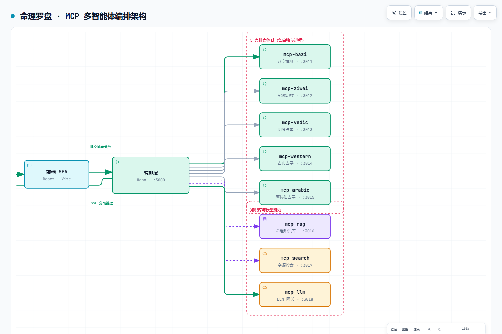

# 命理罗盘 · Destiny Compass

> 一个把 **5 套命理体系拆成 8 个独立 MCP 服务**、由一个编排层统一调度的多智能体应用。
> 前端 React SPA，后端单 Cloudflare Worker，全链路 SSE 分段流式返回。

**12 个包 / 约 9,100 行 TypeScript** · pnpm workspace monorepo · GitHub Actions 自动部署

> ⚠️ **本项目仅供娱乐与工程演示**。命理分析不具科学依据，请勿作为任何决策依据。
> 项目的价值在于**多智能体编排的工程实现**，不在命理本身。

---

## 一、这个项目真正在解决什么

表面上是"多体系命理分析"，工程上它回答的是一个更通用的问题：

> **当一个任务需要 5 套互不相同的算法、外加知识库检索和 LLM 生成时，架构该怎么组织？**

常见的错误做法是把所有逻辑塞进一个服务，结果：

- 改一个排盘算法要重新部署整个应用
- 某套算法挂了，整条链路一起挂
- 无法单独扩容（排盘是 CPU 密集，LLM 调用是 IO 密集）

这里的做法是**把每个能力拆成独立 MCP 进程**，编排层只负责调度与拼装：

| 端口 | 服务 | 职责 |
|---:|---|---|
| 3000 | `orchestrator` | 编排层：pipeline 调度 + EventBus(SSE) + MCP 客户端 |
| 3011 | `mcp-bazi` | 八字排盘（含真太阳时） |
| 3012 | `mcp-ziwei` | 紫微斗数 |
| 3013 | `mcp-vedic` | 印度吠陀占星 |
| 3014 | `mcp-western` | 古典西洋占星 |
| 3015 | `mcp-arabic` | 阿拉伯占星 |
| 3016 | `mcp-rag` | 命理知识库检索 |
| 3017 | `mcp-search` | 多源检索（维基 / Web） |
| 3018 | `mcp-llm` | LLM 网关（OpenAI 兼容） |

---

## 二、架构



> 可缩放 / 可导出 SVG 的交互版本：[`docs/architecture.html`](docs/architecture.html)
> 图源规格：[`docs/architecture.json`](docs/architecture.json)

---

## 三、关键设计取舍

### 1. 为什么拆成 8 个 MCP 进程，而不是一个服务里的 8 个模块

**故障隔离 + 独立扩容 + 可替换**。

- 排盘算法是 CPU 密集、LLM 调用是 IO 密集，混在一个进程里没法各自扩容
- 拆开后某套排盘算法挂了只影响那一路，编排层能降级继续
- 每个 MCP 都是独立进程，可以直接换实现（比如把八字排盘换成第三方服务）而不动编排层

**代价**：多进程部署复杂度上升、跨进程调用有网络开销、需要健康检查与超时控制。
这些代价在下面的工程约束里逐条处理。

### 2. 编排层不含任何排盘算法

`packages/orchestrator` 只做三件事：**调谁、按什么顺序调、结果怎么拼**。
所有领域逻辑都在各自的 MCP 里。

这样编排层是"薄"的，可以被复用去编排别的东西；领域逻辑是"厚"的，可以独立演进。

### 3. pipeline 串行 + SSE 分段推送，而不是等全量返回

分析流程是 5 步串行：

```
STEP 1  真太阳时 + 八字排盘（MCP 调用）
STEP 2  人生总分析（LLM）
STEP 3  年度运势（LLM）
STEP 4  月度运势（LLM）
STEP 5  未来 7 天每日运势（LLM × 7）
```

如果等全部算完再返回，用户要盯着加载圈等几十秒。
所以每完成一段就通过 `analysis` 事件推给前端，前端**分段渲染**——
用户看到第一段时后面还在算，感知延迟大幅下降。

`EventBus` 内部维护了三张表：`history`（事件回放，断线重连不丢）、
`subscribers`（订阅者集合）、`terminated`（已结束的会话），
支持客户端重连后从断点续接。

### 4. 地址用环境变量覆盖，而不是写死 localhost

```ts
export function mcpUrl(name: McpName): string {
  const override = process.env[`MCP_HOST_${name}`];
  if (override) return override.startsWith('http') ? override : `http://${override}`;
  return `http://localhost:${MCP_PORTS[name]}`;
}
```

本地开发全是 localhost 不同端口；部署到 docker / k8s 时用
`MCP_HOST_BAZI=bazi-svc.default.svc.cluster.local` 覆盖即可，**代码零改动**。

### 5. 两级超时，避免单点拖死整链

- 健康检查超时 **2 秒** —— 快速判定服务是否活着，不等
- MCP 调用超时 **30 秒** —— 给 LLM 生成留足时间，但不会无限等

没有超时控制的编排层，一个卡住的 MCP 会把整条链路挂住。

### 6. LLM 输出的硬约束

System prompt 里写死了三条：

```
所有分析必须严格基于给定排盘数据，禁止编造数据
禁止任何空洞套话，每条结论都要落到具体事件、人物、时间
所有输出必须是合法 JSON，禁止任何解释性文字或 markdown
```

**为什么强调"禁止编造"**：排盘数据是外部 MCP 算出来的，LLM 只负责解读。
如果让它自己"脑补"排盘结果，输出会看起来合理但完全错——这是这类应用最容易出的问题。

---

## 四、目录结构

```
destiny-compass/
├── packages/
│   ├── orchestrator/          # 编排层（1,664 行）
│   │   └── src/
│   │       ├── config.ts      # MCP 端口约定 + 地址解析
│   │       ├── event-bus.ts   # SSE 事件总线（history/subscribers/terminated）
│   │       ├── mcp-client/    # 各 MCP 的类型化客户端
│   │       ├── pipeline/      # 5 步串行流水线 + prompt 构建
│   │       └── routes/        # /api/status /api/analyze /api/stream/:id
│   ├── frontend/              # React + Vite（1,596 行）
│   ├── cloudflare-worker/     # Hono 后端（1,311 行）
│   ├── shared/                # 跨包类型与常量（1,104 行）
│   ├── mcp-bazi/  mcp-ziwei/  mcp-vedic/
│   ├── mcp-western/ mcp-arabic/  mcp-rag/
│   ├── mcp-search/  mcp-llm/
│   └── ...
├── .github/workflows/
│   ├── worker.yml             # 自动部署 Worker
│   └── pages.yml              # 自动部署前端
└── docs/architecture.{html,json,png}
```

---

## 五、本地运行

```bash
pnpm install
cp packages/cloudflare-worker/.dev.vars packages/cloudflare-worker/.dev.vars.local
# 编辑 .dev.vars.local 填入 LLM_API_KEY

pnpm dev:worker      # 终端 1：Worker
pnpm dev:frontend    # 终端 2：前端 → http://localhost:5173/destiny-compass/
```

## 六、部署

在仓库 Secrets 中配置 `CLOUDFLARE_API_TOKEN`、`CLOUDFLARE_ACCOUNT_ID`、`LLM_API_KEY`，
推送到 `master` 自动触发部署。前端产物在 `packages/frontend/dist/`，
可放任意静态托管。

---

## 七、已知边界（诚实写在这里）

1. **命理结论不具科学性**。项目定位是工程演示，不是命理工具。
2. **`mcp-ziwei` / `mcp-vedic` / `mcp-western` / `mcp-arabic` 标注 Phase 2**，
   即骨架与接口已就绪，但算法完整度不如 `mcp-bazi`。
3. **缺少端到端测试**。目前只有 `mcp-rag` 有单测（`__tests__/rag-engine.test.ts`），
   编排层的流水线缺少集成测试。这是下一步最该补的。
4. **编排层是单点**。它没有副本，挂了整站不可用。
   生产化需要多副本 + 会话状态外置（现在 EventBus 在进程内存）。
5. **多进程本地开发偏重**，需要 `docker-compose` 或逐个起进程，对新手不够友好。

---

## License

MIT
